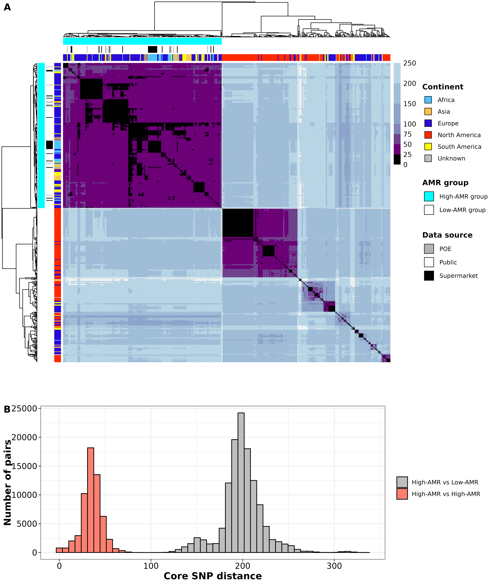

# SEPI
SEPI - Salmonella enterica poultry imports . Data analysis code for the study 'Genomic monitoring of Non-typhoidal Salmonella enterica serotype Minnesota associated with poultry meat imports from Brazil to South Africa'

# Genomic surveillance of Salmonella enterica Minnesota strains from Brazilian poultry products imported into South Africa
##### Authors: Vishnu Raghuram, Thendo Mafuna, Vignesh Ramnath, Hadrien Gourlé, Josefin Blom, Laura Carroll, Itumeleng Matle

##### All raw data can be found in https://zenodo.org/records/15063662
##### The preprint can be found here - https://doi.org/10.1101/2025.04.16.25325939

## Load libraries

```{r echo=F,results='hide'}
library(data.table)
library(dplyr)
library(tidyverse)
library(ggtree)
library(scales)
library(cowplot)
library(treeio)
library(caper)
library(ggnewscale)
library(phytools)
library(Rlsd2)
library(umap)
library(ggside)
library(treeio)
library(ggsignif)
library(ggh4x)
```

### Full data table

``` r
ST548_full_table<-fread("data_tables/TableS1.tsv",header=T,sep="\t")
ST548_full_table<-as.data.frame(ST548_full_table)
rownames(ST548_full_table)<-ST548_full_table$sample_name
```

## Diversity (in core SNPs) of the 36 Brazil-to-ZA genomes

``` r
only_ZA_snps<-fread("Supplemental datasets/Supplemental_dataset_8.tsv",header=F,sep="\t",col.names=c("acc1","acc2","snps"))

only_ZA_snps_matrix <- dcast(only_ZA_snps, acc1 ~ acc2, value.var = "snps")
only_ZA_snps_matrix<-as.data.frame(only_ZA_snps_matrix)

rownames(only_ZA_snps_matrix)<-only_ZA_snps_matrix$acc1
only_ZA_snps_matrix <- only_ZA_snps_matrix[,-1]

my_color<-list(Continent= c(Africa = "#4CC3FF",Asia = "#FFC34C", Europe = "#290AD8",`North America` = "#FF2A00",`South America` = "#FFFF00"
),`Data source`=c(Supermarket = "black",POE="grey70",Public="white"))

only_ZA_heatmap<-pheatmap::pheatmap(only_ZA_snps_matrix,
                   show_rownames = T, 
                   show_colnames = T,
                   annotation_row = ST548_full_table[5],
                   annotation_names_row = F,
                   annotation_col = ST548_full_table[5],
                   annotation_names_col = F,
                   annotation_colors = my_color,
                   color = (c("#555555","#5B3794","#6E3A89","#74599C","#8085B8FF","#8DA3CAFF" ,"#A0BDD8FF" ,"#B7D5E4FF","#F1F1F1FF") ),
                   breaks = c(0,10,20,30,40,50,60,70,80),
                   legend_breaks = c(0,10,20,30,40,50,60,70,80),
                  display_numbers = T ,
                  number_format = "%d",
                  number_color = "black",
                  fontsize_number=8,
                  border_color = "white",
                  clustering_method = "average",
                  silent = T
                   )

Fig1A<-ggplotify::as.ggplot(only_ZA_heatmap)

# Remove self pairs and duplicate pairs
only_ZA_snps <- only_ZA_snps[only_ZA_snps$acc1 != only_ZA_snps$acc2,] %>%
  mutate(pair = ifelse(acc1 < acc2, paste(acc1, acc2, sep = "_"), paste(acc2, acc1, sep = "_"))) %>%
  distinct(pair, .keep_all = TRUE) %>%
  dplyr::select(-pair)

only_ZA_snps<-merge(only_ZA_snps,ST548_full_table[,c(1,5)],by.x="acc1",by.y="sample_name")
only_ZA_snps<-merge(only_ZA_snps,ST548_full_table[,c(1,5)],by.x="acc2",by.y="sample_name")
only_ZA_snps<-only_ZA_snps %>% mutate(concordance = ifelse(`Data source.x` < `Data source.y`, paste(`Data source.x`, `Data source.y`, sep = " vs "), paste(`Data source.y`, `Data source.x`, sep = " vs ")))

Fig1B<-ggplot(only_ZA_snps,aes(x=snps))+
    geom_histogram(fill="black",binwidth = 1)+
    theme_bw()+
    facet_wrap(concordance~.,nrow=3,scales = "free_y")+
    theme(axis.text = element_text(color="black",size=12))+
    theme(strip.text = element_text(color="black",size=12,face="bold"))+
    theme(axis.title = element_text(color="black",face="bold",size=14))+
    theme(panel.grid.minor = element_blank())+
    scale_x_continuous(breaks=pretty_breaks(n=12))+
    scale_y_continuous(breaks=pretty_breaks(n=10))+
    labs(x="Core SNP distance",y="Number of pairs")+scale_y_continuous(breaks = pretty_breaks(n=4))
```

    Scale for y is already present.
    Adding another scale for y, which will replace the existing scale.

``` r
###### hclust 
hc <- hclust(as.dist(only_ZA_snps_matrix),method = "average")
hc$height <- round(hc$height, 6) 

# clustering at 5 SNP intervals from 50 to 5 in a loop

for (i in seq(50,5,-5)){
  int_table<-as.data.frame(cutree(hc,h=i))
  int_table$acc<-rownames(int_table)
  colnames(int_table)[1]=i
  int_table<-int_table[,c(2,1)]
  assign(paste0("int_table_", i), int_table)
}

table_names <- paste0("int_table_", seq(50,5,-5))

hc_table<-lapply(mget(table_names), as.data.frame) %>% reduce(left_join,by="acc")

rm(list=table_names)
rm(int_table)

x<-as.data.frame(apply(hc_table[,-1], 2, max))
x$cluster<-row.names(x)
colnames(x)<-c("Number of clusters","SNP threshold")
x$`Number of clusters`<-as.numeric(x$`Number of clusters`)
x$`SNP threshold`<-as.numeric(x$`SNP threshold`)

Fig1C<-ggplot(x,aes(x=`Number of clusters`,y=`SNP threshold`))+
  geom_point(size=2)+
  geom_line(linetype="dashed")+
  theme_bw()+
  theme(axis.text = element_text(color="black",size=12))+
  theme(axis.title = element_text(color="black",face="bold",size=14))+
  theme(panel.grid.minor = element_blank())+
  scale_x_continuous(breaks=pretty_breaks(n=12))+
  scale_y_continuous(breaks=pretty_breaks(n=10))

Fig1<-plot_grid(Fig1A,NULL,plot_grid(Fig1B,NULL,Fig1C,nrow=3,ncol=1,rel_heights = c(1,0.02,0.5),labels = c("B","","C")),nrow=1,ncol=3,rel_widths = c(1,0.02,0.5),labels=c("A","",""))

ggsave(plot = Fig1,filename = "manuscript_figs/tiff/Fig 1.tif",device="tiff",units="in",dpi=600,width = 18,height=9,compression = "lzw")
ggsave(plot = Fig1,filename = "manuscript_figs/png/Fig 1.png",device="png",units="in",dpi=600,width = 18,height=9)
```

<p align="center">

</p>

## Acquisition of publicly available data from Enterobase and NCBI

### Get NCBI assembly accessions

``` bash

##### Download NCBI genome summary (Was done on 18th July 2024 - file provided in 'data_tables' folder)
wget "https://ftp.ncbi.nlm.nih.gov/genomes/genbank/assembly_summary_genbank.txt"
head -2 assembly_summary_genbank.txt | tail -n +2 | sed 's/#//' > Salmonella_assembly_summary_genbank.txt
grep "Salmonella" assembly_summary_genbank.txt >> Salmonella_assembly_summary_genbank.txt
```

### Read Enterobase assembly table and filter samples

``` r
enterobase_assembly<-fread("data_tables/enterobase_all_assemblystats.tsv",header=T,sep="\t",na.strings = c("","NA","ND","N/D","N/A","NaN"),select=c(1,6,8,13,27,29,34,35,36,37,38))

# Set country as "Unknown" for samples with NA in country column.
enterobase_assembly$Country[is.na(enterobase_assembly$Country)] <- 'Unknown'

# Filter only samples with assemblies,year of isolation, biosample/bioproject IDs and assembly stats
enterobase_assembly<-enterobase_assembly[complete.cases(enterobase_assembly)]

# Read MLST table and get only ST548
enterobase_mlst<-fread("data_tables/enterobase_all_7geneMLST.tsv",header=T,sep="\t",na.strings = c("","NA","ND","-","NaN"),select=c(1,34))
enterobase_mlst<-enterobase_mlst[enterobase_mlst$ST=="548"]
enterobase_assembly<-merge(enterobase_assembly,enterobase_mlst,by="Uberstrain")
remove(enterobase_mlst)

# Read Enterobase serotyping table and get only "Minnesota"
enterobase_serotype<-fread("data_tables/enterobase_all_serotype.tsv",header=T,sep="\t",na.strings = c("","NA","ND","-","NaN"),select=c(1,33,37))
enterobase_serotype<-enterobase_serotype[complete.cases(enterobase_serotype)]
enterobase_serotype<-enterobase_serotype[enterobase_serotype$`SISTR1 Serovar`=="Minnesota" & enterobase_serotype$`SeqSero2 Serovar`=="Minnesota"]

enterobase_assembly<-merge(enterobase_assembly,enterobase_serotype,by="Uberstrain")
remove(enterobase_serotype)

# Filter out only samples with N50\>50000, \<200 contigs, species % >=85
enterobase_assembly<-enterobase_assembly %>% separate_wider_delim(Species, delim = ";", names = c("Species", "Species_percent"))
enterobase_assembly$Species_percent<-gsub("%","",enterobase_assembly$Species_percent)
enterobase_assembly$Species_percent<-as.numeric(enterobase_assembly$Species_percent)

enterobase_assembly<-enterobase_assembly[enterobase_assembly$Species=="Salmonella enterica" & enterobase_assembly$Species_percent>85 & enterobase_assembly$N50>50000 & enterobase_assembly$`Contig Number(>=200 bp)`<200,]

ncbi_assembly<-fread("data_tables/Salmonella_assembly_summary_genbank.txt",header=T,sep="\t",select=c(1,3,12,20,26,31))

# NOTE: Not all assemblies in Enterobase were found in the NCBI summary table as of 16/07/2024.
enterobase_assembly<-merge(enterobase_assembly,ncbi_assembly,by.x="Sample ID",by.y="biosample")
remove(ncbi_assembly)

write.table(enterobase_assembly,file = "Supplemental datasets/Supplemental_dataset_2.tsv",quote=F,row.names =F,col.names = T,sep="\t")
```

### Download assemblies and inspect for outliers using mashtree

``` bash

# download assemblies using ftp link

# mashtree
# 4716019 is the avg length of the 229 public genomes
mashtree --file-of-files paths_to_public_assemblies.txt --genomesize 4716019 > mashtree.dnd
```

``` r
mash_tree<-ggtree(read.tree("misc_files/mashtree.dnd"),size=0.5)+
  geom_tippoint(size=1)+  
  geom_tiplab(align=F,geom="text",size=1)+
    geom_treescale(x = 0.0075,y=200,offset = 5)+
    theme_bw()+
    theme(axis.text = element_text(color="black",size=14))
    ylim(0,230)
```

    <ScaleContinuousPosition>
     Range:  
     Limits:    0 --  230

``` r
# Delete sample GCA_011665355.1_PDT000689951.1 , it seems too distant to be in the same ST

ggsave(mash_tree,file="manuscript_figs/png/FigS1.png",device = "png",dpi=600,width = 8,height = 4)
```

<p align="center">

</p>

## Phylogeny for ST548 genomes

### Run RLSD2 on IQ-TREE

``` r
library(Rlsd2)

tree<-read.tree("misc_files/lsd2/ST548_public_south_africa_iqtree_reformatted.nwk")
x<-as.data.frame(tree$tip.label)
colnames(x)<-"sample_name"

x<-merge(x,ST548_full_table[,c(1,2)],by="sample_name")
write.table(x,file="misc_files/lsd2/ST548_public_south_africa_lsd2_dates.txt",quote=F,sep="\t",row.names = F,col.names = F)

# using preset rate
lsd2(inputTree = tree,inputDate = "misc_files/lsd2/ST548_public_south_africa_lsd2_dates.txt",seqLen=4708764,estimateRoot = "as",confidenceInterval = 1000,outFile = "misc_files/lsd2/ST548_public_south_africa_lsd2_fixed",givenRate = 1.27e-7)

# Using fixed rate
lsd2(inputTree = tree,inputDate = "misc_files/lsd2/ST548_public_south_africa_lsd2_dates.txt",seqLen=4708764,estimateRoot = "as",confidenceInterval = 1000,outFile = "misc_files/lsd2/ST548_public_south_africa_lsd2_estimated")
```

### Read annotation data

``` r
# Read AMRFinderPlus data
amrfindersummary<-fread("Supplemental datasets/Supplemental_dataset_3.tsv",header=T,sep="\t",na.strings = "NA")

# Read plasmidfinder data
plasmid<-fread("Supplemental datasets/Supplemental_dataset_4.tsv",sep="\t",header=T)

plasmid_annot<-plasmid[plasmid$`%IDENTITY`>80 & plasmid$`%COVERAGE`>80,c(1,6)] %>% mutate(present=1) %>% group_by(`#FILE`,GENE) %>% summarise(Freq = sum(present)) %>% pivot_wider(names_from = GENE,values_from = Freq,values_fill = 0,)
```

    `summarise()` has grouped output by '#FILE'. You can override using the
    `.groups` argument.

``` r
plasmid_annot<-as.data.frame(plasmid_annot)
rownames(plasmid_annot)<-plasmid_annot$`#FILE`
plasmid_annot<-plasmid_annot[,-1]

plasmid_annot<-plasmid_annot[, order(colSums(plasmid_annot), decreasing = TRUE)]

plasmid_annot<-plasmid_annot %>% mutate(across(everything(), ~ ifelse(. != "0", "PRESENT", "ABSENT")))

# Set colour palettes
cont_pal <- c(
  Africa = "#4CC3FF",
  Asia = "#FFC34C",
  Europe = "#290AD8",
  `North America` = "#FF2A00",
  `South America` = "#FFFF00",
  Unknown = "grey90"
)

antibiotic_pal <- c(
  AMINOGLYCOSIDE = "#50FF50",
  `BETA-LACTAM` = "#FF86FF",
  FOSFOMYCIN = "#005000",
  PHENICOL = "#FFB6DB",
  QUINOLONE = "#00BB00",
  SULFONAMIDE = "#BB00BB",
    TETRACYCLINE = "#BBFFBB",
  TRIMETHOPRIM = "#500050",
  ABSENT = "#FFFFFF00"
)

amrfinder_presabs<- as.data.frame(amrfindersummary[ amrfindersummary$`Element subtype`=="AMR",c(1,7,12)]) %>%
  distinct() %>%
  pivot_wider(names_from = `Gene symbol`, values_from = Class, values_fill = "ABSENT")
amrfinder_presabs<-as.data.frame(amrfinder_presabs)
rownames(amrfinder_presabs)<-amrfinder_presabs$sample_name

ordered_gene_symbols <- as.data.frame(amrfindersummary[amrfindersummary$sample_name %in% ST548_full_table$sample_name & amrfindersummary$`Element subtype`=="AMR" &  amrfindersummary$`Gene symbol`!="mdsA" & amrfindersummary$`Gene symbol` !="mdsB",]) %>% 
  dplyr::select(`Gene symbol`, Class) %>% 
  distinct() %>%
  arrange(Class) %>%
  pull(`Gene symbol`)

amrfinder_presabs <- amrfinder_presabs[, ordered_gene_symbols]

#tree_annot<-merge(ST548_full_table[,c(1,3,4,6)],za_samples_metadata[,c(1,7)],by.x="sample_name",by.y="acc",all.x = T)
```

### LSD2-rate-estimated ML tree

``` r
tree_lsd2<-read.nexus("misc_files/lsd2/ST548_public_south_africa_lsd2_estimated.date.nexus")

# Get samples in 'High-AMR clade'
high_amr_clade<-clade.members(277,tree_lsd2,tip.labels = T)


t<-ggtree(tree_lsd2,mrsd="2022-06-01") %<+% ST548_full_table +
    geom_tippoint(size=2,aes(color=Continent))+
    scale_color_manual(values=cont_pal)+
    new_scale_color()+
    geom_tiplab(align = T,as_ylab = F,geom = "text",size=3,aes(label=`Data source`,color=`Data source`))+
    scale_color_manual(values = c("grey50","#FFFFFF00","black"),guide="none")+
    theme_tree2()+
    theme(panel.grid.major.x = element_line(color="grey85"))+
    theme(axis.text=element_text(size=10,color="black"))+
    theme(legend.position = "right") + 
    geom_hilight(node=277, type='roundrect',fill="#bbcdd5")+
    geom_cladelab(node=311, label="ZA SNP\ncluster 0", align=F,hjust=0.7,offset=-30,fontsize=3,textcolor="#007FFF",barcolor='#007FFF',barsize=1,geom="label",fill="white")+
  scale_x_continuous(breaks = c(1700,1750,1800,1850,1900,1950,2000))+
  guides(fill = guide_legend(override.aes = list(size=7)))
  
# Add dummy column with blank values for visualization purposes
filtered_amrfinder_presabs<-amrfinder_presabs[,c(1,2,3,4,7,13,17,19,21)]
filtered_amrfinder_presabs<-add_column(filtered_amrfinder_presabs,` `="ABSENT",.after=4)
filtered_amrfinder_presabs<-add_column(filtered_amrfinder_presabs,`  `="ABSENT",.after=7)
filtered_amrfinder_presabs<-add_column(filtered_amrfinder_presabs,`   `="ABSENT",.after=9)
filtered_amrfinder_presabs<-add_column(filtered_amrfinder_presabs,`    `="ABSENT",.after=11)

tt<-gheatmap(t,filtered_amrfinder_presabs,offset = 80,width=1.452,colnames=T,color = "grey80",font.size =5,colnames_offset_y = 1,hjust = 0,colnames_angle = 90,colnames_position = 'top')+
  scale_fill_manual("AMR Class",values=antibiotic_pal)+
  theme(axis.text.x=element_text(size=12,angle=90,hjust=1,vjust=0.5,color="black",face="bold"))+
  guides(colour = guide_legend(override.aes = list(size=5)))+
  theme(legend.text=element_text(size=12))+
  theme(legend.title=element_text(size=14,face="bold"))+
  geom_vline(xintercept = c(2112,2198,2219.5,2261,2283,2304,2325,2346,2368,2389),color="black")+
  new_scale_fill()
```

    Scale for fill is already present.
    Adding another scale for fill, which will replace the existing scale.

    Warning in names(guides$guides)[to_change] <- paste0(names(guides$guides), :
    number of items to replace is not a multiple of replacement length

``` r
Fig2<-gheatmap(tt,plasmid_annot[c(1:5)],offset=380,width=0.51,colnames=T,color="grey80",colnames_angle = 90,colnames_offset_y = 1,colnames_position = "top",font.size = 5,hjust = 0)+
  scale_fill_manual("Plasmid",values=c("white","black"),na.value = "white",na.translate=F)+
    theme(axis.text.x=element_text(size=12,angle=90,hjust=1,vjust=0.5,color="black",face="bold"))+
  geom_vline(xintercept = c(2412.5,2509),color="black")+
  ggtree::vexpand(.06, 1)+
  guides(color = "none")
```

    Scale for fill is already present.
    Adding another scale for fill, which will replace the existing scale.

``` r
ggsave(plot=Fig2,filename = "manuscript_figs/png/Fig 2.png",device="png",units="in",dpi=600,width = 20,height=23)

ggsave(plot=Fig2,filename = "manuscript_figs/tiff/Fig 2.tif",device="tiff",units="in",dpi=600,width = 20,height=23,compression = "lzw")
```

<p align="center">

</p>

### High AMR subclade BEAST

``` r
bt<-read.beast("misc_files/beast_runs/beast_combined_tree_treeannotator")

t<-ggtree(bt,mrsd="2022-06-01") %<+% ST548_full_table +
    geom_tippoint(size=2,aes(color=Continent))+
    scale_color_manual(values=cont_pal)+
    new_scale_color()+
    geom_tiplab(align = T,as_ylab = F,geom = "text",size=3,aes(label=`Data source`,color=`Data source`))+
    scale_color_manual(values = c("grey50","#FFFFFF00","black"),guide="none")+
    theme_tree2()+
    theme(panel.grid.major.x = element_line(color="grey85"))+
    theme(axis.text=element_text(size=10,color="black"))+
    theme(legend.position = "right") + 
  geom_range("height_0.95_HPD", color='grey', size=2, alpha=.75,linewidth=1.5)+
  scale_x_continuous(breaks = c(2010,2012,2014,2016,2018,2020,2022))+
  guides(fill = guide_legend(override.aes = list(size=7)))


tt<-gheatmap(t,filtered_amrfinder_presabs[,c(-1,-2)],offset = 2,width=0.51,colnames=T,color = "grey80",font.size =4,colnames_offset_y = 1,hjust = 0,colnames_angle = 90,colnames_position = 'top')+
  scale_fill_manual("AMR Class",values=antibiotic_pal)+
  theme(axis.text.x=element_text(size=12,angle=90,hjust=1,vjust=0.5,color="black",face="bold"))+
  guides(colour = guide_legend(override.aes = list(size=5)))+
  theme(legend.text=element_text(size=12))+
  theme(legend.title=element_text(size=14,face="bold"))+
  new_scale_fill()
```

    Scale for fill is already present.
    Adding another scale for fill, which will replace the existing scale.

    Warning in names(guides$guides)[to_change] <- paste0(names(guides$guides), :
    number of items to replace is not a multiple of replacement length

``` r
Fig4<-gheatmap(tt,plasmid_annot[,1:5],offset=9,width=0.25,colnames=T,color="grey80",colnames_angle = 90,colnames_offset_y = 1,colnames_position = "top",font.size = 4,hjust = 0)+
  scale_fill_manual("Plasmid",values=c("white","black"),na.value = "white",na.translate=F)+
    theme(axis.text.x=element_text(size=12,angle=90,hjust=1,vjust=0.5,color="black",face="bold"))+
  ggtree::vexpand(.1, 1)+
  guides(color = "none")+
  geom_vline(xintercept = c(2024.7,2025.8,2026.35,2027.47,2028.025,2028.57,2029.14,2029.68,2030.24,2030.79,2031.74,2034.69))
```

    Scale for fill is already present.
    Adding another scale for fill, which will replace the existing scale.

    Warning: The following aesthetics were dropped during statistical transformation:
    center, lower, and upper.
    ℹ This can happen when ggplot fails to infer the correct grouping structure in
      the data.
    ℹ Did you forget to specify a `group` aesthetic or to convert a numerical
      variable into a factor?

``` r
ggsave(plot=Fig4,filename = "manuscript_figs/png/Fig 4.png",device="png",units="in",dpi=600,width = 20,height=10)
```

    Warning: The following aesthetics were dropped during statistical transformation:
    center, lower, and upper.
    ℹ This can happen when ggplot fails to infer the correct grouping structure in
      the data.
    ℹ Did you forget to specify a `group` aesthetic or to convert a numerical
      variable into a factor?

``` r
ggsave(plot=Fig4,filename = "manuscript_figs/tiff/Fig 4.tif",device="tiff",units="in",dpi=600,width = 20,height=10,compression = "lzw")
```

    Warning: The following aesthetics were dropped during statistical transformation:
    center, lower, and upper.
    ℹ This can happen when ggplot fails to infer the correct grouping structure in
      the data.
    ℹ Did you forget to specify a `group` aesthetic or to convert a numerical
      variable into a factor?

``` r
# Bayesian skyline plot

bs_plot<-fread("misc_files/beast_runs/beast_combined_tree_bayesian_skyline.txt",header=T,sep="\t")

FigS7A<-ggplot(data=bs_plot,aes(x=time))+
  geom_ribbon(aes(ymin = lower, ymax = upper), alpha = 0.2)+
  geom_line(aes(x=time,y=median))+
  scale_y_continuous(trans="log10")+
  theme_bw()+
  scale_x_continuous(breaks=pretty_breaks(n=8))+
  theme(axis.text = element_text(size=12,color="black"))+
  theme(axis.title=element_text(size=14,color="black",face="bold"))+
  xlab("Time")+
  ylab("Effective population size")+
  labs(subtitle = "")

ggsave(plot=FigS7A,filename = "manuscript_figs/png/FigS7A.png",device="png",units="in",dpi=600,width = 5,height=5)

ggsave(plot=FigS7A,filename = "manuscript_figs/tiff/FigS7A.tif",device="tiff",units="in",dpi=600,width = 5,height=5,compression = "lzw")

library(TipDatingBeast)
#PlotDRT("misc_files/beast_runs/beast_randomized_2e9/only_AMR_EU_random_with_bounds",reps=10,burnin=0.1)
```

<p align="center">

</p>
<p align="center">

</p>

### Supplemental phylogenies

#### Core SNP distances across 264 ST548 genomes

``` r
snps<-fread("Supplemental datasets/Supplemental_dataset_7.tsv",header=F,sep="\t",col.names=c("Ref_file","Query_file","gubbins_snps")) #snippy-gubbins alignment

# shortening file names to match sample names
snps$Ref_file<-sub('(GCA_.*)_.*', '\\1', snps$Ref_file)
snps$Ref_file[snps$Ref_file=="GCA_009853965.1_CRJJGF_00079"]<-"GCA_009853965.1"
snps$Query_file<-sub('(GCA_.*)_.*', '\\1', snps$Query_file)
snps$Query_file[snps$Query_file=="GCA_009853965.1_CRJJGF_00079"]<-"GCA_009853965.1"

snp_matrix <- dcast(snps, Ref_file ~ Query_file, value.var = "gubbins_snps")
snp_matrix<-as.data.frame(snp_matrix)

rownames(snp_matrix)<-snp_matrix$Ref_file
snp_matrix <- snp_matrix[,-1]

#annot<-merge(ST548_full_table[,c(1,6)],za_samples_metadata[,c(1,7)],by.x="sample_name",by.y="acc",all.x=T) %>% replace_na(list(`Data source` = 'Public data'))

ST548_full_table$`AMR group`[ST548_full_table$sample_name %in% high_amr_clade]<-"High-AMR group"
ST548_full_table$`AMR group`[!ST548_full_table$sample_name %in% high_amr_clade]<-"Low-AMR group"
rownames(ST548_full_table)<-ST548_full_table$sample_name

my_color<-list(Continent= c(Africa = "#4CC3FF",Asia = "#FFC34C", Europe = "#290AD8",`North America` = "#FF2A00",`South America` = "#FFFF00"
),`Data source`=c(Supermarket = "black",POE="grey70",`Public`="white"),`AMR group`=c(`High-AMR group`="cyan",`Low-AMR group`="white"))

FigS2A<-pheatmap::pheatmap(snp_matrix,
                   show_rownames = F, 
                   show_colnames = F,
                   annotation_row = ST548_full_table[,c(4,5,11)],
                   annotation_names_row = F,
                   annotation_col = ST548_full_table[,c(4,5,11)],
                   annotation_names_col = F,
                   annotation_colors = my_color,
                   color = (c("#000000","#6B0077FF","#6F418DFF","#8085B8FF","#8DA3CAFF" ,"#A0BDD8FF" ,"#B7D5E4FF","#F1F1F1FF","#FFFFFF") ),
                   breaks = c(0,25,50,75,100,150,200,250),
                   legend_breaks = c(0,25,50,75,100,150,200,250),
                   fontsize_row = 2,
                   fontsize_col = 2,
                   clustering_method = "average",
                   annotation_legend = F,
                   silent = T
                   )

# Dummy plot just to generate a fig legend for the heatmap
FigS2Aleg<-ggplot(data=ST548_full_table)+
  geom_point(aes(x=Continent,y=sample_name,fill=Continent),shape=22,size=5)+
  scale_fill_manual(values=c("#4CC3FF","#FFC34C","#290AD8","#FF2A00","#FFFF00"))+
  ggnewscale::new_scale_fill()+
  geom_point(aes(x=`Data source`,y=sample_name,fill=`Data source`),shape=22,size=7)+
  scale_fill_manual(values=c("grey70","white","black"))+
  ggnewscale::new_scale_fill()+
  geom_point(aes(x=`AMR group`,y=sample_name,fill=`AMR group`),shape=22,size=7)+
  scale_fill_manual(values=c("cyan","white"))+
  theme_bw()+
  theme(legend.title = element_text(face="bold"))

snps<-merge(snps,ST548_full_table,by.x="Query_file",by.y="sample_name")
snps<-merge(snps,ST548_full_table,by.x="Ref_file",by.y="sample_name")
snps$concordance[snps$`AMR group.x`==snps$`AMR group.y`]<-"same AMR group"
snps$concordance[snps$`AMR group.x`!=snps$`AMR group.y`]<-"different AMR group"

FigS2B<-ggplot(snps[!(snps$`AMR group.x`=="Low-AMR group" & snps$`AMR group.y`=="Low-AMR group"),],aes(x=gubbins_snps))+
  geom_histogram(color="black",aes(fill=concordance),bins=50)+
  scale_fill_manual("",values=c("grey","salmon"),labels=c("High-AMR vs Low-AMR","High-AMR vs High-AMR"))+
  theme_bw()+
  theme(axis.text=element_text(size=12,color="black"))+
  theme(axis.title=element_text(size=14,color="black",face="bold"))+
  labs(x="Core SNP distance",y="Number of pairs")

FigS2<-plot_grid(plot_grid(ggplotify::as.ggplot(FigS2A),NULL,get_legend(FigS2Aleg),NULL,ncol=4,rel_widths = c(1,0.03,0.1,0.03),labels=c("A","")),NULL,FigS2B,ncol=1,labels = c("","","B"),rel_heights = c(1,0.1,0.5))
```

    Warning in get_plot_component(plot, "guide-box"): Multiple components found;
    returning the first one. To return all, use `return_all = TRUE`.

``` r
ggsave(plot=FigS2,filename = "manuscript_figs/tiff/FigS2.tif",device="tiff",units="in",dpi=600,width = 10,height=12,compression = "lzw")
ggsave(plot=FigS2,filename = "manuscript_figs/png/FigS2.png",device="png",units="in",dpi=600,width = 10,height=12)
```

<p align="center">

</p>

##### Get closest public genome to SEPI genome

``` r
find_closest_sample <- function(pairwise_df, subset_samples) {
  pairwise_df %>%
    # Filter out rows where both Ref_file and Query_file are in the subset
    dplyr::filter(!(Ref_file %in% subset_samples & Query_file %in% subset_samples)) %>%
    # Filter rows where Ref_file is in the subset
    dplyr::filter(Ref_file %in% subset_samples) %>%
    # Group by Ref_file
    dplyr::group_by(Ref_file) %>%
    # Find the row with the minimum SNPs for each Ref_file
    dplyr::slice_min(gubbins_snps, with_ties = T) %>%
    # Select relevant columns
    dplyr::select(Ref_file, Query_file, gubbins_snps) %>%
    # Rename the output columns for clarity
    dplyr::rename(Closest_public_sample = Query_file, Distance = gubbins_snps) %>%
    dplyr::ungroup()
}

za_closest_public<-find_closest_sample(snps,ST548_full_table$sample_name[ST548_full_table$`Data source`!="Public"])
za_closest_public<-merge(za_closest_public,ST548_full_table[,c(-5,-7)],by.x="Closest_public_sample",by.y="sample_name")

write.table(za_closest_public,file="data_tables/TableS2.tsv",row.names=F,col.names=T,sep="\t",quote=F)
```

#### Midpoint rooted tree

``` r
tree<-read.tree("misc_files/lsd2/ST548_public_south_africa_iqtree_reformatted.nwk")
tree<-midpoint_root(tree)

t<-ggtree(tree)  %<+% ST548_full_table +
    geom_tippoint(size=2,aes(color=Continent))+
    scale_color_manual(values=cont_pal)+
    new_scale_color()+
    geom_tiplab(align = T,as_ylab = F,geom = "text",size=3,aes(label=`Data source`,color=`Data source`))+
  scale_color_manual(values = c("grey50","#FFFFFF00","black"),guide="none")+
  theme_tree2()+
  theme(panel.grid.major.x = element_line(color="grey85"))+
  theme(axis.text=element_text(size=10,color="black"))+
  theme(legend.position = "right") + 
  geom_hilight(node=307, type='roundrect',fill="#bbcdd5")+
  geom_cladelab(node=394, label="ZA SNP\ncluster 0", align=F,hjust=-0.1,offset=0.000001,fontsize=3,textcolor="#007FFF",barcolor='#007FFF',barsize=1,geom="label",fill="white")+
  scale_x_continuous(breaks = c(0,0.5e-05,1e-05,1.5e-05,2e-05,2.5e-05,3e-05))+
  guides(fill = guide_legend(override.aes = list(size=7)))

tt<-gheatmap(t,amrfinder_presabs,offset = 0.00001,width=1,colnames=T,color = "grey80",font.size =3,colnames_offset_y = 1,hjust = 0,colnames_angle = 90,colnames_position = 'top')+
  scale_fill_manual("AMR Class",values=antibiotic_pal)+
  theme(axis.text.x=element_text(size=12,angle=90,hjust=1,vjust=0.5,color="black",face="bold"))+
  guides(colour = guide_legend(override.aes = list(size=5)))+
  theme(legend.text=element_text(size=12))+
  theme(legend.title=element_text(size=14,face="bold"))+
  new_scale_fill()
```

    Scale for fill is already present.
    Adding another scale for fill, which will replace the existing scale.

    Warning in names(guides$guides)[to_change] <- paste0(names(guides$guides), :
    number of items to replace is not a multiple of replacement length

``` r
FigS3<-gheatmap(tt,plasmid_annot,offset=0.00005,width=1,colnames=T,color="grey80",colnames_angle = 90,colnames_offset_y = 1,colnames_position = "top",font.size = 3,hjust = 0)+
  scale_fill_manual("Plasmid",values=c("white","black"),na.value = "white",na.translate=F)+
    theme(axis.text.x=element_text(size=12,angle=90,hjust=1,vjust=0.5,color="black",face="bold"))+
  ggtree::vexpand(.1, 1)+
  guides(color = "none")
```

    Scale for fill is already present.
    Adding another scale for fill, which will replace the existing scale.

``` r
ggsave(plot=FigS3,filename = "manuscript_figs/png/FigS3.png",device="png",units="in",dpi=600,width = 20,height=23)
ggsave(plot=FigS3,filename = "manuscript_figs/tiff/FigS3.tif",device="tiff",units="in",dpi=600,width = 20,height=23,compression = "lzw")
```

<p align="center">

</p>

#### LSD2-fixed-rate ML tree

``` r
tree_lsd2<-read.nexus("misc_files/lsd2/ST548_public_south_africa_lsd2_fixed.date.nexus")

# Get samples in 'High-AMR clade'
high_amr_clade<-clade.members(277,tree_lsd2,tip.labels = T)


t<-ggtree(tree_lsd2,mrsd="2022-06-01") %<+% ST548_full_table +
    geom_tippoint(size=2,aes(color=Continent))+
    scale_color_manual(values=cont_pal)+
    new_scale_color()+
    geom_tiplab(align = T,as_ylab = F,geom = "text",size=3,aes(label=`Data source`,color=`Data source`))+
    scale_color_manual(values = c("grey50","#FFFFFF00","black"),guide="none")+
    theme_tree2()+
    theme(panel.grid.major.x = element_line(color="grey85"))+
    theme(axis.text=element_text(size=10,color="black"))+
    theme(legend.position = "right") + 
    geom_hilight(node=277, type='roundrect',fill="#bbcdd5")+
    geom_cladelab(node=311, label="ZA SNP\ncluster 0", align=F,hjust=0.7,offset=-30,fontsize=3,textcolor="#007FFF",barcolor='#007FFF',barsize=1,geom="label",fill="white")+
  scale_x_continuous(breaks = c(1700,1750,1800,1850,1900,1950,2000))+
  guides(fill = guide_legend(override.aes = list(size=7)))

tt<-gheatmap(t,amrfinder_presabs,offset = 80,width=0.51,colnames=T,color = "grey80",font.size =3,colnames_offset_y = 1,hjust = 0,colnames_angle = 90,colnames_position = 'top')+
  scale_fill_manual("AMR Class",values=antibiotic_pal)+
  theme(axis.text.x=element_text(size=12,angle=90,hjust=1,vjust=0.5,color="black",face="bold"))+
  guides(colour = guide_legend(override.aes = list(size=5)))+
  theme(legend.text=element_text(size=12))+
  theme(legend.title=element_text(size=14,face="bold"))+
  new_scale_fill()
```

    Scale for fill is already present.
    Adding another scale for fill, which will replace the existing scale.

    Warning in names(guides$guides)[to_change] <- paste0(names(guides$guides), :
    number of items to replace is not a multiple of replacement length

``` r
FigS4<-gheatmap(tt,plasmid_annot,offset=280,width=0.51,colnames=T,color="grey80",colnames_angle = 90,colnames_offset_y = 1,colnames_position = "top",font.size = 3,hjust = 0)+
  scale_fill_manual("Plasmid",values=c("white","black"),na.value = "white",na.translate=F)+
    theme(axis.text.x=element_text(size=12,angle=90,hjust=1,vjust=0.5,color="black",face="bold"))+
  ggtree::vexpand(.1, 1)+
  guides(color = "none")
```

    Scale for fill is already present.
    Adding another scale for fill, which will replace the existing scale.

``` r
ggsave(plot=FigS4,filename = "manuscript_figs/png/FigS4.png",device="png",units="in",dpi=600,width = 20,height=23)
ggsave(plot=FigS4,filename = "manuscript_figs/tiff/FigS4.tif",device="tiff",units="in",dpi=600,width = 20,height=23,compression = "lzw")
```

<p align="center">

</p>

#### FULL LSD2-rate-estimated ML tree

``` r
tree_lsd2<-read.beast("misc_files/lsd2/ST548_public_south_africa_lsd2_estimated.date.nexus")

# Get samples in 'High-AMR clade'
high_amr_clade<-clade.members(277,as.phylo(tree_lsd2),tip.labels = T)

t<-ggtree(tree_lsd2,mrsd="2022-06-01") %<+% ST548_full_table +
    geom_tippoint(size=2,aes(color=Continent))+
    scale_color_manual(values=cont_pal)+
    new_scale_color()+
    geom_tiplab(align = T,as_ylab = F,geom = "text",size=3,aes(label=`Data source`,color=`Data source`))+
    scale_color_manual(values = c("grey50","#FFFFFF00","black"),guide="none")+
    theme_tree2()+
    theme(panel.grid.major.x = element_line(color="grey85"))+
    theme(axis.text=element_text(size=10,color="black"))+
    theme(legend.position = "right") + 
    geom_hilight(node=277, type='roundrect',fill="#bbcdd5")+
    geom_cladelab(node=311, label="ZA SNP\ncluster 0", align=F,hjust=0.7,offset=-30,fontsize=3,textcolor="#007FFF",barcolor='#007FFF',barsize=1,geom="label",fill="white")+
  geom_range("CI_date", color='grey', size=2, alpha=.5,linewidth=0.7)+
  scale_x_continuous(breaks = c(1700,1750,1800,1850,1900,1950,2000))+
  guides(fill = guide_legend(override.aes = list(size=7)))

tt<-gheatmap(t,amrfinder_presabs,offset = 100,width=0.51,colnames=T,color = "grey80",font.size =3,colnames_offset_y = 1,hjust = 0,colnames_angle = 90,colnames_position = 'top')+
  scale_fill_manual("AMR Class",values=antibiotic_pal)+
  theme(axis.text.x=element_text(size=12,angle=90,hjust=1,vjust=0.5,color="black",face="bold"))+
  guides(colour = guide_legend(override.aes = list(size=5)))+
  theme(legend.text=element_text(size=12))+
  theme(legend.title=element_text(size=14,face="bold"))+
  new_scale_fill()
```

    Scale for fill is already present.
    Adding another scale for fill, which will replace the existing scale.

    Warning in names(guides$guides)[to_change] <- paste0(names(guides$guides), :
    number of items to replace is not a multiple of replacement length

``` r
FigS5<-gheatmap(tt,plasmid_annot,offset=210,width=0.51,colnames=T,color="grey80",colnames_angle = 90,colnames_offset_y = 1,colnames_position = "top",font.size = 3,hjust = 0)+
  scale_fill_manual("Plasmid",values=c("white","black"),na.value = "white",na.translate=F)+
    theme(axis.text.x=element_text(size=12,angle=90,hjust=1,vjust=0.5,color="black",face="bold"))+
  ggtree::vexpand(.1, 1)+
  guides(color = "none")
```

    Scale for fill is already present.
    Adding another scale for fill, which will replace the existing scale.

    Warning: The following aesthetics were dropped during statistical transformation:
    center, lower, and upper.
    ℹ This can happen when ggplot fails to infer the correct grouping structure in
      the data.
    ℹ Did you forget to specify a `group` aesthetic or to convert a numerical
      variable into a factor?

``` r
ggsave(plot=FigS5,filename = "manuscript_figs/png/FigS5.png",device="png",units="in",dpi=600,width = 20,height=23)
```

    Warning: The following aesthetics were dropped during statistical transformation:
    center, lower, and upper.
    ℹ This can happen when ggplot fails to infer the correct grouping structure in
      the data.
    ℹ Did you forget to specify a `group` aesthetic or to convert a numerical
      variable into a factor?

``` r
ggsave(plot=FigS5,filename = "manuscript_figs/tiff/FigS5.tif",device="tiff",units="in",dpi=600,width = 20,height=23,compression = "lzw")
```

    Warning: The following aesthetics were dropped during statistical transformation:
    center, lower, and upper.
    ℹ This can happen when ggplot fails to infer the correct grouping structure in
      the data.
    ℹ Did you forget to specify a `group` aesthetic or to convert a numerical
      variable into a factor?

<p align="center">

</p>

#### High AMR subclade tree

``` r
# Number of AMR classes in each sample in the high-AMR clade
amrfindersummary[amrfindersummary$`Element type`=="AMR" & amrfindersummary$sample_name %in% high_amr_clade & amrfindersummary$Class!="EFFLUX",c(1,12)] %>% distinct() %>% group_by(sample_name) %>% count()
```

    # A tibble: 108 × 2
    # Groups:   sample_name [108]
       sample_name     n
       <chr>       <int>
     1 100N            5
     2 101N            4
     3 23              5
     4 256             5
     5 263             5
     6 264             4
     7 282             5
     8 290             4
     9 291             5
    10 292             4
    # ℹ 98 more rows

``` r
tree_highamr<-read.tree("misc_files/lsd2/ST548_high_AMR_clade_iqtree.treefile")
tree_highamr$tip.label<-sub('(GCA_.*)_.*', '\\1', tree_highamr$tip.label)
tree_highamr$tip.label[tree_highamr$tip.label=="GCA_009853965.1_CRJJGF_00079"]<-"GCA_009853965.1"
tree_highamr<-midpoint_root(tree_highamr)

# Using midpoint-rooted tree
t<-ggtree(tree_highamr) %<+% ST548_full_table +
    geom_tippoint(size=2,aes(color=Continent))+
    scale_color_manual(values=cont_pal)+
    new_scale_color()+
    geom_tiplab(align = T,as_ylab = F,geom = "text",size=2,aes(label=`Data source`,color=`Data source`))+
   scale_color_manual(values = c("grey50","#FFFFFF00","black"),guide="none")+
    theme_tree2()+
    theme(panel.grid.major.x = element_line(color="grey85"))+
    theme(axis.text=element_text(size=10,color="black"))+
    theme(legend.position = "right") + 
  scale_x_continuous(breaks=c(0,2.5e-6,5e-6,7.5e-6,1e-5))+
  guides(fill = guide_legend(override.aes = list(size=7)))

tt<-gheatmap(t,amrfinder_presabs,offset = 3.5e-6,width=0.51,colnames=T,color = "grey80",font.size =3,colnames_offset_y = 1,hjust = 0,colnames_angle = 90,colnames_position = 'top')+
  scale_fill_manual("AMR Class",values=antibiotic_pal)+
  theme(axis.text.x=element_text(size=12,angle=90,hjust=1,vjust=0.5,color="black",face="bold"))+
  guides(colour = guide_legend(override.aes = list(size=5)))+
  theme(legend.text=element_text(size=12))+
  theme(legend.title=element_text(size=14,face="bold"))+
  new_scale_fill()
```

    Scale for fill is already present.
    Adding another scale for fill, which will replace the existing scale.

    Warning in names(guides$guides)[to_change] <- paste0(names(guides$guides), :
    number of items to replace is not a multiple of replacement length

``` r
FigS6A<-gheatmap(tt,plasmid_annot,offset=1e-5,width=0.51,colnames=T,color="grey80",colnames_angle = 90,colnames_offset_y = 1,colnames_position = "top",font.size = 2,hjust = 0)+
  scale_fill_manual("Plasmid",values=c("white","black"),na.value = "white",na.translate=F)+
    theme(axis.text.x=element_text(size=12,angle=90,hjust=1,vjust=0.5,color="black",face="bold"))+
  ggtree::vexpand(.1, 1)+
  guides(color = "none")+
  theme(legend.position = "none")
```

    Scale for fill is already present.
    Adding another scale for fill, which will replace the existing scale.

``` r
# using estimated rate
lsd2(inputTree = tree_highamr,inputDate = "misc_files/lsd2/ST548_public_south_africa_lsd2_dates.txt",seqLen=4708764,estimateRoot = "as",confidenceInterval = 1000,outFile = "misc_files/lsd2/ST548_high_AMR_clade_lsd2")
```

    Reading output trees ...
    Done.

    $rate
    [1] 5.981359e-07

    $tMRCA
    [1] 2009.894

    $newickTree

    Phylogenetic tree with 108 tips and 62 internal nodes.

    Tip labels:
      23, GCA_003891035.1, GCA_007659145.1, GCA_020835465.1, GCA_007176155.1, GCA_007600215.1, ...
    Node labels:
      , 100, 95, 100, 96, 100, ...

    Rooted; includes branch lengths.

    $dateNexusTree
    'treedata' S4 object that stored information
    of
        'misc_files/lsd2/ST548_high_AMR_clade_lsd2.date.nexus'.

    ...@ phylo:

    Phylogenetic tree with 108 tips and 62 internal nodes.

    Tip labels:
      23, GCA_003891035.1, GCA_007659145.1, GCA_020835465.1, GCA_007176155.1,
    GCA_007600215.1, ...
    Node labels:
      , 100, 95, 100, 96, 100, ...

    Rooted; includes branch lengths.

    with the following features available:
      'CI_date', 'CI_height', 'date'.

    # The associated data tibble abstraction: 170 × 6
    # The 'node', 'label' and 'isTip' are from the phylo tree.
        node label           isTip CI_date   CI_height  date
       <int> <chr>           <lgl> <list>    <list>    <dbl>
     1     1 23              TRUE  <dbl [1]> <dbl [1]> 2020 
     2     2 GCA_003891035.1 TRUE  <dbl [1]> <dbl [1]> 2017 
     3     3 GCA_007659145.1 TRUE  <dbl [2]> <dbl [2]> 2017.
     4     4 GCA_020835465.1 TRUE  <dbl [2]> <dbl [2]> 2021.
     5     5 GCA_007176155.1 TRUE  <dbl [2]> <dbl [2]> 2013.
     6     6 GCA_007600215.1 TRUE  <dbl [2]> <dbl [2]> 2015.
     7     7 GCA_019514205.1 TRUE  <dbl [2]> <dbl [2]> 2015.
     8     8 GCA_007239295.1 TRUE  <dbl [2]> <dbl [2]> 2015.
     9     9 319             TRUE  <dbl [1]> <dbl [1]> 2022 
    10    10 98N             TRUE  <dbl [1]> <dbl [1]> 2022 
    # ℹ 160 more rows

    $outResultFiles
    [1] "misc_files/lsd2/ST548_high_AMR_clade_lsd2"           
    [2] "misc_files/lsd2/ST548_high_AMR_clade_lsd2.nwk"       
    [3] "misc_files/lsd2/ST548_high_AMR_clade_lsd2.date.nexus"

``` r
tree_highamr_lsd2<-read.nexus("misc_files/lsd2/ST548_high_AMR_clade_lsd2.date.nexus")

t<-ggtree(tree_highamr_lsd2,mrsd="2022-06-01") %<+% ST548_full_table +
    geom_tippoint(size=2,aes(color=Continent))+
    scale_color_manual(values=cont_pal)+
    new_scale_color()+
    geom_tiplab(align = T,as_ylab = F,geom = "text",size=3,aes(label=`Data source`,color=`Data source`))+
    scale_color_manual(values = c("grey50","#FFFFFF00","black"),guide="none")+
    theme_tree2()+
    theme(panel.grid.major.x = element_line(color="grey85"))+
    theme(axis.text=element_text(size=10,color="black"))+
    theme(legend.position = "right") + 
  scale_x_continuous(breaks = c(2000,2005,2010,2015,2020))+
  guides(fill = guide_legend(override.aes = list(size=7)))

tt<-gheatmap(t,amrfinder_presabs,offset = 5,width=0.51,colnames=T,color = "grey80",font.size =3,colnames_offset_y = 1,hjust = 0,colnames_angle = 90,colnames_position = 'top')+
  scale_fill_manual("AMR Class",values=antibiotic_pal)+
  theme(axis.text.x=element_text(size=12,angle=90,hjust=1,vjust=0.5,color="black",face="bold"))+
  guides(colour = guide_legend(override.aes = list(size=5)))+
  theme(legend.text=element_text(size=12))+
  theme(legend.title=element_text(size=14,face="bold"))+
  new_scale_fill()
```

    Scale for fill is already present.
    Adding another scale for fill, which will replace the existing scale.

    Warning in names(guides$guides)[to_change] <- paste0(names(guides$guides), :
    number of items to replace is not a multiple of replacement length

``` r
FigS6B<-gheatmap(tt,plasmid_annot,offset=15,width=0.51,colnames=T,color="grey80",colnames_angle = 90,colnames_offset_y = 1,colnames_position = "top",font.size = 3,hjust = 0)+
  scale_fill_manual("Plasmid",values=c("white","black"),na.value = "white",na.translate=F)+
    theme(axis.text.x=element_text(size=12,angle=90,hjust=1,vjust=0.5,color="black",face="bold"))+
  ggtree::vexpand(.1, 1)+
  guides(color = "none")
```

    Scale for fill is already present.
    Adding another scale for fill, which will replace the existing scale.

``` r
FigS6Bleg<-get_legend(FigS6B)
```

    Warning in get_plot_component(plot, "guide-box"): Multiple components found;
    returning the first one. To return all, use `return_all = TRUE`.

``` r
FigS6<-plot_grid(plot_grid((FigS6A+theme(legend.position="none")),NULL,(FigS6B+theme(legend.position="none")),labels=c("A","","B"),ncol=1,rel_heights = c(1,0.1,1)),NULL,ggplotify::as.ggplot(FigS6Bleg),labels=c("","",""),ncol=3,rel_widths = c(1,0.05,0.2))

ggsave(plot=FigS6,filename = "manuscript_figs/png/FigS6.png",device="png",units="in",dpi=600,width = 20,height=23)
ggsave(plot=FigS6,filename = "manuscript_figs/tiff/FigS6.tif",device="tiff",units="in",dpi=600,width = 20,height=23,compression = "lzw")
```

<p align="center">

</p>

## Accessory genome based UMAP

``` r
panaroo_presabs<-fread("Supplemental datasets/Supplemental_dataset_5.tsv",header=T,sep="\t")

colnames(panaroo_presabs)<-sub('(GCA_.*)_.*_genomic', '\\1', colnames(panaroo_presabs))
names(panaroo_presabs)[names(panaroo_presabs) == 'GCA_009853965.1_CRJJGF_00079'] <- 'GCA_009853965.1'

gene_freq<-cbind(panaroo_presabs[,1],rowSums(panaroo_presabs[,-1]))
colnames(gene_freq)<-c("Gene","Freq")
gene_freq$perc<-gene_freq$Freq*100/max(gene_freq$Freq)
int_genes<-as.data.frame(gene_freq$Gene[gene_freq$perc < 95 & gene_freq$perc > 5])

genes_list<-as.data.frame(int_genes)
colnames(genes_list)<-"Gene"

genes_list<-merge(genes_list,panaroo_presabs,by="Gene")
genes_list<-as.data.frame(t(genes_list))

#Convert gene names to header and add accession colmumn
header.true <- function(df) {
  names(df) <- as.character(unlist(df[1,]))
  df[-1,]
}
genes_list<-header.true(genes_list)
genes_list[1:ncol(genes_list)]<-sapply(genes_list[1:ncol(genes_list)],as.numeric)

genes_list_umap<-as.data.frame(genes_list)
set.seed(1000);umap_fit<-umap(genes_list_umap)
umap_df <- as.data.frame(umap_fit$layout)
colnames(umap_df)<-c("umap1","umap2")

#Saving accessions as another columm
genes_list_umap$sample<-rownames(genes_list_umap)

#Converting rownames from accessions to indexes to match with tsne table index
rownames(genes_list_umap) <- 1:nrow(genes_list_umap)

#Reeformatting umap table

umap_df$index <- 1:nrow(umap_df)
umap_df<-merge(umap_df,genes_list_umap[,c(ncol(genes_list_umap))],by.x='index',by.y='row.names')

umap_df<-umap_df[,c(4,2,3)]
colnames(umap_df)<-c("acc","umap1","umap2")
umap_df<-merge(ST548_full_table,umap_df,by.x="sample_name",by.y="acc")

Fig3<-ggplot(data=umap_df,aes(x=umap1,y=umap2,fill=Continent))+
  geom_hline(yintercept = 0,color="grey90")+
  geom_vline(xintercept = 0,color="grey90")+
  geom_point(shape=21,size=2.5,color="black")+
  scale_fill_manual("Continent",values=c(cont_pal))+
  theme_bw()+
  theme(axis.text = element_blank())+
  theme(axis.title = element_text(size=14,face="bold"))+
  theme(axis.ticks = element_blank())+
  theme(legend.position = "right")+
  theme(legend.title.position = "top",legend.title = element_text(face="bold"))+
  theme(legend.text = element_text(size=8))+
  guides(fill = guide_legend(ncol =2 ,override.aes = list(size=7)))+
  theme(legend.text = element_text(size=14))+
  xlim(-11,11)+
  ylim(-15,15)+
  guides(color = "none")+
  ggforce::geom_mark_ellipse(aes(color=`AMR group`),fill=NA)+
  scale_color_manual(values=c("cyan","black"))+
  theme(panel.grid = element_blank())+
  annotate("text", x=-6, y=-12, label= "High-AMR group")+
  annotate("text", x=5, y=13, label= "Low-AMR group")+
  geom_segment(aes(x = -6, y = -8, xend = -6, yend = -11), arrow = arrow(length = unit(0.5, "cm")))+
  geom_segment(aes(x = 5, y = 9.5, xend = 5, yend = 12), arrow = arrow(length = unit(0.5, "cm")))+
  ggnewscale::new_scale_fill()+
  geom_xsidehistogram(position="stack",bins=50,aes(fill=`AMR group`,color=`AMR group`)) +
  geom_ysidehistogram(position="stack",bins=50,aes(fill=`AMR group`,color=`AMR group`)) +
  scale_fill_manual(values=c("cyan","black"))+
  theme(ggside.panel.scale = .3)
```

    Warning in names(guides$guides)[to_change] <- paste0(names(guides$guides), :
    number of items to replace is not a multiple of replacement length

``` r
ggsave(plot=Fig3,filename = "manuscript_figs/tiff/Fig 3.tif",device="tiff",units="in",dpi=600,width = 7,height=5,compression = "lzw")
ggsave(plot=Fig3,filename = "manuscript_figs/png/Fig 3.png",device="png",units="in",dpi=600,width = 7,height=5)
```

<p align="center">

</p>

## Genomad

``` r
genomad_summary<-fread("Supplemental datasets/Supplemental_dataset_9.tsv",header=F,sep="\t",col.names=c("sample_name","Contig id","chromosome_score","plasmid_score","virus_score"))

genomad_amrfinder<-merge(amrfindersummary[amrfindersummary$`Element subtype`=="AMR" & amrfindersummary$`Gene symbol`!="mdsA" & amrfindersummary$`Gene symbol` != "mdsB",c(1,3,7,12)],genomad_summary,by=c("sample_name","Contig id")) %>% pivot_longer(cols=5:7,names_to = "genomad_id",values_to = "genomad_score")

genomad_amrfinder$genomad_id<-gsub("_score","",genomad_amrfinder$genomad_id)

Fig5<-ggplot(genomad_amrfinder[genomad_amrfinder$`Gene symbol` %in% c("aadA1","aph(3'')-Ib","aph(3')-Ia","aph(6)-Id","blaCMY-2","blaCTX-M-8","qnrB19","sul2","tet(A)","tet(B)"),],aes(x=genomad_id,y=genomad_score,colour = genomad_id))+
  geom_boxplot(width=0.5,size=0.5,outlier.size = 0.5)+
  facet_wrap2(vars(Class,`Gene symbol`),nrow=1,strip = strip_nested(background_x = elem_list_rect(fill=c("#50FF50","#FF86FF","#00BB00","#BB00BB","#BBFFBB","white","white","white","white","white","white","white","white","white","white")) ))+
  theme_bw()+
  theme(axis.title.x = element_blank())+
  theme(axis.title.y = element_text(color="black",size=14,face="bold"))+
  theme(axis.text.x = element_text(color="black",size=14,face="bold",angle=45,hjust=1,vjust=1))+
  theme(axis.text.y = element_text(color="black",size=12))+
  theme(strip.text = element_text(color="black",size=14,face="bold"))+
  theme(strip.background = element_rect(fill = NA))+
  theme(legend.position = "none")+
  theme(legend.text = element_text(size=8))+
  guides(fill = guide_legend(ncol =3 ,override.aes = list(size=7)))+
  theme(legend.text = element_text(size=14))+
  scale_color_manual(values=c("black","black","black"))+
  labs(y="Genomad score")

ggsave(filename = "manuscript_figs/tiff/Fig 5.tif",device="tiff",units="in",dpi=600,width = 16,height=5,compression = "lzw")
ggsave(filename = "manuscript_figs/png/Fig 5.png",device="png",units="in",dpi=600,width = 16,height=5)

### Genomad test

genomad_summary$amr[genomad_summary$`Contig id` %in% amrfindersummary$`Contig id`]<-"yes"
genomad_summary$amr[!genomad_summary$`Contig id` %in% amrfindersummary$`Contig id`]<-"no"

wilcox.test(plasmid_score ~ amr, data = genomad_summary)
```


        Wilcoxon rank sum test with continuity correction

    data:  plasmid_score by amr
    W = 10431837, p-value < 2.2e-16
    alternative hypothesis: true location shift is not equal to 0

``` r
genomad_S1<-ggplot(genomad_summary,aes(sample=plasmid_score))+
  stat_qq() + 
  stat_qq_line()+
  theme_bw()+
  theme(axis.title = element_text(color="black",size=14,face="bold"))+
  theme(axis.text = element_text(color="black",size=12))+
  labs(x="Theoretical quantiles",y="Sample quantiles")

genomad_S2<-ggplot(genomad_summary,aes(x=plasmid_score))+
  geom_histogram(fill="black",bins=100)+
  theme_bw()+
  theme(axis.title = element_text(color="black",size=14,face="bold"))+
  theme(axis.text = element_text(color="black",size=12))+
  labs(x="Genomad plasmid score",y="Count")

genomad_S3<-ggplot(genomad_summary,aes(x=amr,y=plasmid_score))+
  geom_violin()+
  geom_boxplot(width=0.1,size=1,outliers = F)+
  theme_bw()+
 theme(axis.title = element_text(color="black",size=14,face="bold"))+
  theme(axis.text.y = element_text(color="black",size=12))+
  theme(axis.text.x = element_text(color="black",size=14,face="bold"))+
  scale_x_discrete(labels=c("AMR-","AMR+"))+
  labs(y="Genomad plasmid score",x="")+
  scale_y_continuous(breaks=pretty_breaks(n=10))+
  geom_signif(comparisons = list(c("no", "yes")))


FigS8<-plot_grid(plot_grid(genomad_S1,NULL,genomad_S2,nrow=3,labels = c("A","","B"),rel_heights = c(1,0.1,1)),NULL,genomad_S3,nrow=1,labels = c("","","C"),rel_widths = c(1,0.1,1))


ggsave(filename = "manuscript_figs/tiff/FigS8.tif",device="tiff",units="in",dpi=600,width = 7,height=7,compression = "lzw",plot=FigS8)
ggsave(filename = "manuscript_figs/png/FigS8.png",device="png",units="in",dpi=600,width = 7,height=7,plot=FigS8)
```

<p align="center">

</p>

## Comparing with ATB blactxm8+ isolates

#### Script for getting metadata from biosampleID

``` bash

esearch -db biosample -query $biosample_ID | efetch -format xml | xtract -pattern BioSample -element @accession OrganismName \
-NAME "(NA)" \
-block Id -if Id@db_label -equals "Sample name" -NAME Id \
-block Ids -element "&NAME" \
-DATE "(NA)" \
-block Attribute -if Attribute@attribute_name -equals "collection_date" -DATE Attribute \
-block Attributes -element "&DATE" \
-LOC "(NA)" \
-block Attribute -if Attribute@attribute_name -equals "geo_loc_name" -LOC Attribute \
-block Attributes -element "&LOC" \
-HOST "(NA)" \
-block Attribute -if Attribute@attribute_name -equals "host" -HOST Attribute \
-block Attributes -element "&HOST" \
-SOURCE "(NA)" \
-block Attribute -if Attribute@attribute_name -equals "isolation_source" -SOURCE Attribute \
-block Attributes -element "&SOURCE" 

# 
```

#### blaCTX-M-8 positive genomes from ATB vs SEPI genomes core SNP distances

``` r
s<-fread("Supplemental datasets/Supplemental_dataset_15.tsv",header=F,sep="\t",col.names = c("sample1","sample2","snps"))

# remove reference 
s_matrix <- dcast(s[s$sample1!="GCA_006209225.1_PDT000316796.1" & s$sample2!="GCA_006209225.1_PDT000316796.1",], sample1 ~ sample2, value.var = "snps")
s_matrix<-as.data.frame(s_matrix)

rownames(s_matrix)<-s_matrix$sample1
s_matrix <- s_matrix[,-1]

s16<-fread("Supplemental datasets/Supplemental_dataset_16.tsv",header=T,sep="\t",na.strings = c("NA","missing","not collected", "not provided","Not available","not applicable"))

# Reformatting country column
s16$Country<-gsub(":.*","",s16$Country)

#Reformatting dates column
s16$collection_date<-gsub("-.*","",s16$collection_date)

# Writing continents column
library(countrycode)
s16$Continent<-countrycode(sourcevar = s16$Country,origin = "country.name",destination = "continent",custom_match = c(Canada = "North America" , USA = "North America"))
s16$Continent<-gsub("Americas","South America",s16$Continent)

s16$`Data source`<-"ATB"

b<-rbind((s16[,c(1,7,4,5,8,9)]),(ST548_full_table[ST548_full_table$`Data source`!="Public",c(1,6,2,3,4,5)]),use.names=F)
b<-as.data.frame(b)
rownames(b)<-b$biosample
b$collection_date<-as.factor(b$collection_date)

my_color<-list(Continent= c(Africa = "#4CC3FF",Asia = "#FFC34C", Europe = "#290AD8",`North America` = "#FF2A00",`South America` = "#FFFF00",Unknown = "white"), `Data source`=c(Supermarket = "black",ATB="white"),collection_date=c(`2016`="#FEBEB1",`2017`="#EB6F5B",`2018`="#CE352E",`2019`="#B52027",`2020`="#9C0824",`2021`="#830717",`2022`="#69000C",Unknown = "white"))

FigS9<-pheatmap::pheatmap(s_matrix,
                   show_rownames = T, 
                   show_colnames = T,
                   annotation_row = b[,c(3,5,6)],
                   annotation_names_row = F,
                   annotation_col = b[,c(3,5,6)],
                   annotation_names_col = F,
                   annotation_colors = my_color,
                   color = (c("#555555","#5B3794","#6E3A89","#74599C","#8085B8FF","#8DA3CAFF" ,"#A0BDD8FF" ,"#B7D5E4FF","#F1F1F1FF","#FFFFFF") ),
                   breaks = c(0,10,25,50,75,100,150,200,250,300),
                   legend_breaks = c(0,10,25,50,75,100,150,200,250,300),
                  display_numbers = T ,
                  number_format = "%d",
                  number_color = "black",
                  fontsize_number=12,
                  border_color = "white",
                  clustering_method = "average",
                  silent=T
                   )

ggsave(filename = "manuscript_figs/tiff/FigS9.tif",plot=ggplotify::as.ggplot(FigS9),device="tiff",units="in",dpi=600,width = 16,height=12,compression = "lzw")
ggsave(filename = "manuscript_figs/png/FigS9.png",plot=ggplotify::as.ggplot(FigS9),device="png",units="in",dpi=600,width = 16,height=12)
```

<p align="center">

</p>

#### Get closest public ZA genome to SEPI genome

``` r
find_closest_sample <- function(pairwise_df, subset_samples) {
  pairwise_df %>%
    # Filter out rows where both Ref_file and Query_file are in the subset
    dplyr::filter(!(Ref_file %in% subset_samples & Query_file %in% subset_samples)) %>%
    # Filter rows where Ref_file is in the subset
    dplyr::filter(Ref_file %in% subset_samples) %>%
    # Group by Ref_file
    dplyr::group_by(Ref_file) %>%
    # Find the row with the minimum SNPs for each Ref_file
    dplyr::slice_min(gubbins_snps, with_ties = T) %>%
    # Select relevant columns
    dplyr::select(Ref_file, Query_file, gubbins_snps) %>%
    # Rename the output columns for clarity
    dplyr::rename(Closest_ZA_public_sample = Query_file, Distance = gubbins_snps) %>%
    dplyr::ungroup()
}

snps<-fread("Supplemental datasets/Supplemental_dataset_17.tsv",header=F,sep="\t",col.names=c("Ref_file","Query_file","gubbins_snps")) #snippy-gubbins alignment

# shortening file names to match sample names
snps$Ref_file<-sub('(GCA_.*)_.*', '\\1', snps$Ref_file)
snps$Ref_file[snps$Ref_file=="GCA_009853965.1_CRJJGF_00079"]<-"GCA_009853965.1"
snps$Query_file<-sub('(GCA_.*)_.*', '\\1', snps$Query_file)
snps$Query_file[snps$Query_file=="GCA_009853965.1_CRJJGF_00079"]<-"GCA_009853965.1"

za_closest_public<-find_closest_sample(snps,ST548_full_table$sample_name[ST548_full_table$`Data source`!="Public"])
za_closest_public$Closest_ZA_public_sample<-gsub(".fa","",za_closest_public$Closest_ZA_public_sample)

# Get metadata from enterobase
enterobase_assembly<-fread("data_tables/enterobase_all_assemblystats.tsv",header=T,sep="\t",na.strings = c("","NA","ND","N/D","N/A","NaN"),select=c(1,6,8,13,27,29,34,35,36,37,38))

za_closest_public<-merge(za_closest_public,enterobase_assembly[enterobase_assembly$`Sample ID` %in% c(unique(za_closest_public$Closest_ZA_public_sample)),c(3,4,2,6,5)],by.x="Closest_ZA_public_sample",by.y="Sample ID")

write.table(za_closest_public,file="data_tables/TableS3.tsv",row.names=F,col.names=T,sep="\t",quote=F)
```
